## 主页面

主菜单的实现 C++ 的代码在都在文件夹 **MenuMain** 中。

在该文件夹中有如下类。

* **ACharacterStyleAvatar** 第三人称人物的化身。该类继承自 **Actor**,该类只是用于展示人物，因此使用 Actor 就可以了。
* **UMainMenu** UI 类，该类继承自 **UUserWidget**。
* **AMainMenuPlayerController** 继承自 **APlayerController** 。该类是菜单页面世界的玩家控制器。
* **AMainMenuSaveGame** 继承自 **USaveGame**。


为了方便区分，本项目中所有的蓝图类前面都加上前缀 **BP_**,蓝图部分的代码在两个文件夹中。分为 GamePlay 和 UI 部分。

对应的 GamePlay 蓝图类在如下文件夹中。其中 **BP_CharacterStyleAvatar**类,**BP_MainPlayerController** 继承自上面的 C++ 父类。

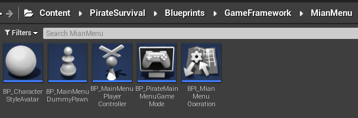

对应的 UI 部分的蓝图代码在文件夹中在`Content/PirateSurival/UI/MainMenu`。

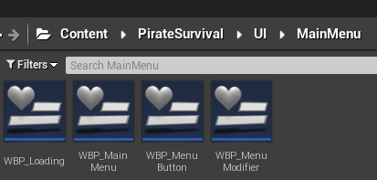

### GameMode 部分

PlayerControllerClass 使用的是 BP_MainMenuPlayerController。

DefaultPawnClass 使用的是 BP_MainMenuDummyPawn。由于在菜单展示页面不需要控制玩家，因此选择BP_MainMenuDummyPawn 继承自 Pawn。不需要有行走的能力。

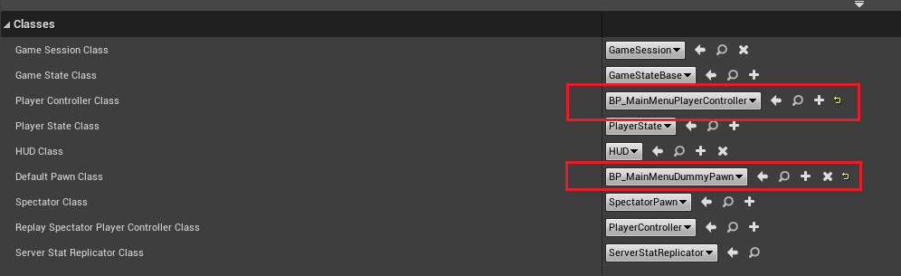

### 开始页面

点击编辑器的开始按钮时，将展示下面的页面。

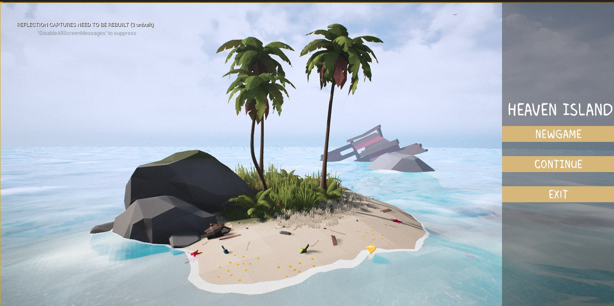

此时执行了玩家控制器中`Event BeginPlay` 事件。并将 WBP_MainMenu 创建出来并添加到视口中，通过 `GetControllerPawn` 得到玩家控制的 Pawn，并将该 Pawn 强制转换为我们自己创建的 Pawn（BP_MainMenuDummyPawn)。这样才可以调用我们自己身上特有的属性和函数。

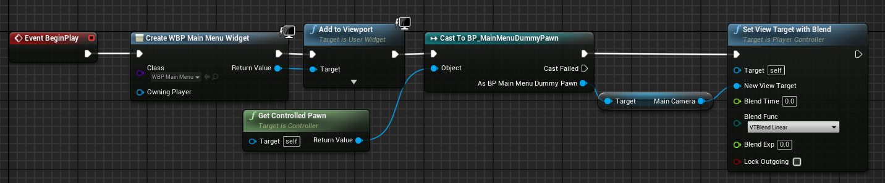

在 `BP_MainMenuDummyPawn` 蓝图类中增加了两个变量。

* `MainCamera` 点击编辑器的开始按钮时使用的摄像机。
* `CharacterCamera` 点击菜单中的**NewGame**按钮时通过使用的摄像机。

用于保存两个摄像机的引用。

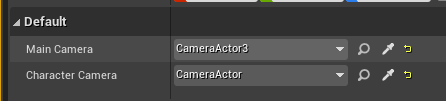

### 进入NewGame

当点击 **NewGame** 按钮时触发 `OnClick` 事件。此时通过 `BPI_MainMenuOperation` （在玩家控制器中实现了该接口）蓝图接口中的 `NewGameOperate` 函数,这种方式可以理解为消息的调用方式。`GetOwningPlayer`函数获得和当前 UI 相关的玩家控制器，因为我们在该玩家控制器中将UI添加到视口中，因此通过这种方式可以很容易的获得。 

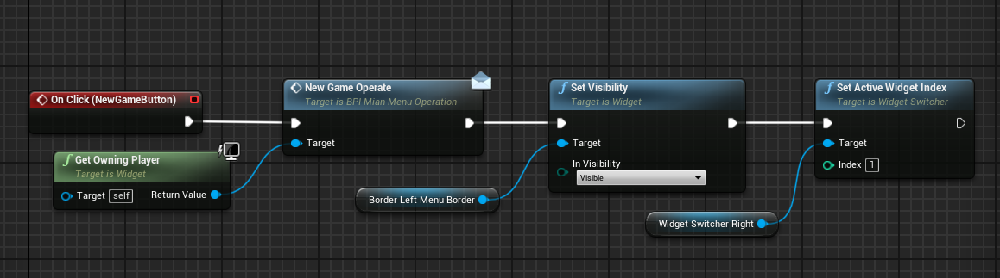

在玩家控制器中实现的`NewGameOperate` 函数。

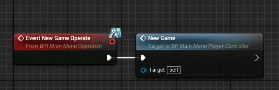

在`NewGame` 函数中实现摄像机的混合，从之前的进入游戏时的菜单以一种过渡的方式变换到人物前面的摄像机。通过调用蓝图节点`SetViewTargetWithBlend`将`BlendTime`设置为两秒，此时的效果将更加的明显。

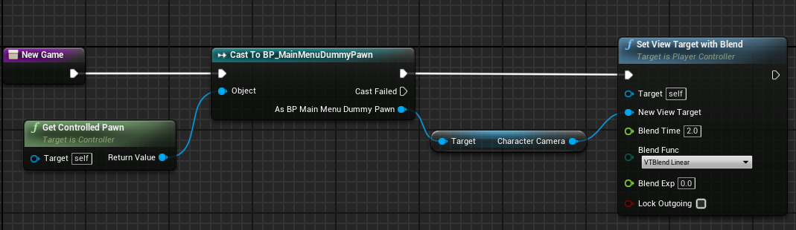

点击 NewGame  进入到选择界面。

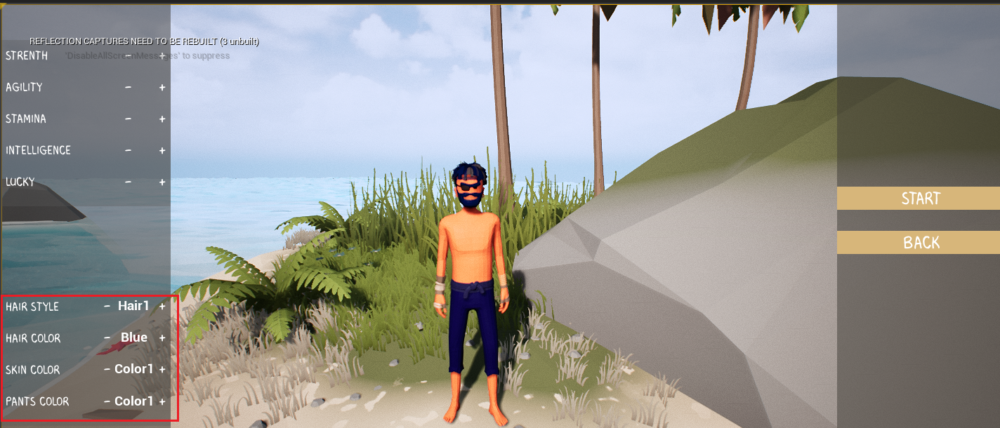

此时可以通过左下角中红圈部分的选项修改人物的一些特性。

此时组主要的类是`CharacterStyleAvatar`。

#### CharacterStyleAvatar类的介绍

**头文件**

```C++
// Easy Systems

#pragma once

#include "CoreMinimal.h"
#include "GameFramework/Actor.h"
#include "Engine/DataTable.h"
#include "CharacterStyleAvatar.generated.h"

USTRUCT(BlueprintType)
struct FCharacterTypeOpteratorConfig : public FTableRowBase 
{
	GENERATED_BODY()

	UPROPERTY(BlueprintReadWrite, EditAnywhere)
		bool bChangeColor = false;								// 用于确定是修改角色身体各个部位的的颜色，还是修改头部组件的资产

	UPROPERTY(BlueprintReadWrite, EditAnywhere)
		TMap<FName, USkeletalMesh*> StyleMeshMap;				// 存储身体某部分的样式

	UPROPERTY(BlueprintReadWrite, EditAnywhere)
		TMap<FName, FLinearColor> StyleColor;                   // 存储身体某个部位对应的颜色

};

UCLASS()
class EASYSURVIVALRPGV2_5_API ACharacterStyleAvatar : public AActor
{
	GENERATED_BODY()
	
public:	
	// Sets default values for this actor's properties
	ACharacterStyleAvatar();

protected:
	// Called when the game starts or when spawned
	virtual void BeginPlay() override;

public:	
	// Called every frame
	virtual void Tick(float DeltaTime) override;

private:
	UPROPERTY(VisibleAnywhere)
		USceneComponent* RootComp;

	UPROPERTY(EditDefaultsOnly)
		TSoftObjectPtr<UDataTable> StyleTable;

	UPROPERTY(EditDefaultsOnly)
		TArray<TSoftObjectPtr<USkeletalMesh>> DefaultMeshes;		// 除了头以外的其它部件手,身体等

	UPROPERTY(EditDefaultsOnly)
		TSubclassOf<UAnimInstance> AnimClass;						// 人物的动画蓝图

	UDataTable* ConfigDataTable;                                    // 保存从蓝图中加载的表的数据
	TSharedPtr<struct FStreamableHandle> TableLoadHandle;			//struct 是前置声明
	TMap<FName, TArray<USkeletalMeshComponent*>> CharacterStyleComp;

	USkeletalMeshComponent* HeadMesh;
	USkeletalMeshComponent* BodyMesh;
	USkeletalMeshComponent* HandsMesh;
	USkeletalMeshComponent* LegsMesh;
	USkeletalMeshComponent* FeetMesh;

	class UMainMenuSaveGame* Save;									// 保存实时修改的人物装饰的数据					

	void InitiateAvatar(UDataTable* ConfigTable);					// 加载头
	void ChangeStyle(FString Tag,int PreIndex, int Index);
};

```

头文件代码的详细介绍。

==变量介绍==

1. `FCharacterTypeOpteratorConfig`是一个结构体，相当于数据库的表结构。简单的说就是表中每一行的结构和该结构体的每一个字段相互对应。其中

   在蓝图中对应的表如下。

   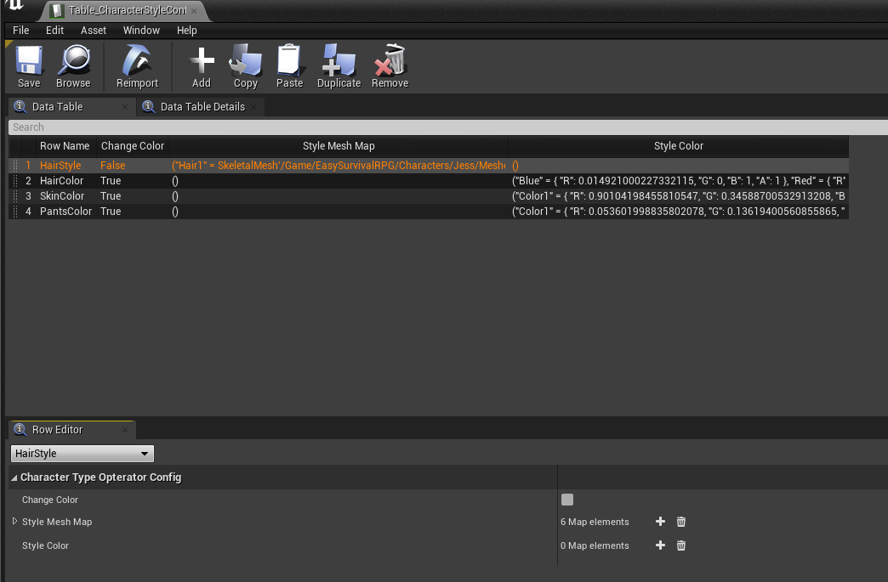

**从蓝图中获取数据的一些属性**

2. `StyleTable` 属性。

   该属性用于对应蓝图中的 **UDataTable** 类型的表。方便可以在 C++ 中使用蓝图中表的数据。在该类的 C++ 类的蓝图子类中对应的属性，此时需要在蓝图中选择一个表。在这里选择的是 `Table_CharacterStyleConfig` 表。也就是选择上面一条对应的表结构体的表。

   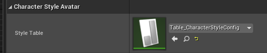

3. `TArray<TSoftObjectPtr<USkeletalMesh>> DefaultMeshes;` 该数组用于对应骨骼网格数组。该属性也是从蓝图中获取数据。

   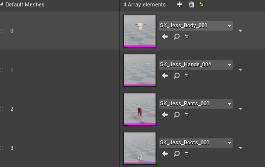

4. `TSubclassOf<UAnimInstance> AnimClass` 用于对应动画。


**在 C++ 的类中使用的一些属性**

5. `TSharedPtr<struct FStreamableHandle> TableLoadHandle;`  用于从蓝图中加载表格的属性。
6. `class UMainMenuSaveGame* Save;` 该属性用于将修改的人物的属性保存起来。

==函数介绍==

1. `void InitiateAvatar(UDataTable* ConfigTable);` 该函数用于初始化将从蓝图中加载的属性保存在 C++ 定义的变量中。
2. `void ChangeStyle(FString Tag,int PreIndex, int Index);` 该函数当玩家点击 UI 界面中加号和减号修改人物的骨骼或者样式时调用。

****

**源文件**

```C++
// Easy Systems


#include "MenuMain/CharacterStyleAvatar.h"
#include "Engine/AssetManager.h"
#include "Kismet/GameplayStatics.h"
#include "Global/GlobalDelegateManager.h"
#include "MenuMain/MainMenuSaveGame.h"


// Sets default values
ACharacterStyleAvatar::ACharacterStyleAvatar()
{
 	// Set this actor to call Tick() every frame.  You can turn this off to improve performance if you don't need it.
	PrimaryActorTick.bCanEverTick = true;
	RootComp = CreateDefaultSubobject<USceneComponent>(TEXT("RootComp"));
	SetRootComponent(RootComp);

	HeadMesh = CreateDefaultSubobject<USkeletalMeshComponent>(TEXT("HeadMesh"));
	HeadMesh->SetupAttachment(RootComponent);
	BodyMesh = CreateDefaultSubobject<USkeletalMeshComponent>(TEXT("BodyMesh"));
	BodyMesh->SetupAttachment(RootComponent);
	HandsMesh = CreateDefaultSubobject<USkeletalMeshComponent>(TEXT("HandsMesh"));
	HandsMesh->SetupAttachment(RootComponent);
	LegsMesh = CreateDefaultSubobject<USkeletalMeshComponent>(TEXT("LegsMesh"));
	LegsMesh->SetupAttachment(RootComponent);
	FeetMesh = CreateDefaultSubobject<USkeletalMeshComponent>(TEXT("FeetMesh"));
	FeetMesh->SetupAttachment(RootComponent);

	//FCharacterTypeOpteratorConfig::StaticStruct();                         // 得到结构体类型的引用指针和类是差不多的概念
}

// Called when the game starts or when spawned
void ACharacterStyleAvatar::BeginPlay()
{
	Super::BeginPlay();
	
	TArray<FSoftObjectPath> InitiateAssetPathArray;							// 用于异步请求的对象
	InitiateAssetPathArray.Add(StyleTable.ToSoftObjectPath());
	for (auto&  Mesh: DefaultMeshes)
	{
		InitiateAssetPathArray.Add(Mesh.ToSoftObjectPath());
	}

	TableLoadHandle = UAssetManager::GetStreamableManager().RequestAsyncLoad(InitiateAssetPathArray, [=]()  // 这里的 = 号相当于 this
		{
			// 加载 Table_CharacterStyleConfig 表格中的数据
			if (auto Table = Cast<UDataTable>(TableLoadHandle.Get()->GetLoadedAsset()))             // 这里的 lamdom 表达式是加载成功之后调用的
			{
				//UKismetSystemLibrary::PrintString(GetWorld(),LoadObject->GetName());
				InitiateAvatar(Table);
			}
			
			/*加载除了头以外的其它的骨骼网格资产, 并应用到各个部分的网格组件上*/
			//start
			TArray<UObject*> AllAssets;
			TArray<USkeletalMeshComponent*> MeshComp = { BodyMesh,HandsMesh,LegsMesh,FeetMesh };
			TableLoadHandle.Get()->GetLoadedAssets(AllAssets);

			for (int i = 1; i < AllAssets.Num(); i++)
				if (auto Mesh = Cast<USkeletalMesh>(AllAssets[i])) 
					if (MeshComp.IsValidIndex(i-1))
						MeshComp[i - 1]->SetSkeletalMesh(Mesh);
			//end

			// 对人物的修改器中的文本进行初始化
			ChangeStyle("HairStyle", 0, 0);
			ChangeStyle("HairColor", 0, 0);
			ChangeStyle("SkinColor", 0, 0);
			ChangeStyle("PantsColor", 0, 0);

			// 加载动画
			HeadMesh->SetAnimInstanceClass(AnimClass);
			BodyMesh->SetMasterPoseComponent(HeadMesh);
			HandsMesh->SetMasterPoseComponent(HeadMesh);
			LegsMesh->SetMasterPoseComponent(HeadMesh);
			FeetMesh->SetMasterPoseComponent(HeadMesh);

		});

	// 绑定委托,当玩家点击 UI 中加号和减号改变人物骨骼或者颜色时调用
	// 调用委托在 MainHUD.cpp 中的 ModifyChracterStates 的函数中
	GlobalDelegateManager::Get()->BindGenericDelegateByString<void(FString,int,int)>
		(MAINMENU_CHANGE_STYLE, this, &ACharacterStyleAvatar::ChangeStyle);
}

// Called every frame
void ACharacterStyleAvatar::Tick(float DeltaTime)
{
	Super::Tick(DeltaTime);
}

void ACharacterStyleAvatar::InitiateAvatar(UDataTable* ConfigTable)
{
	// 无效或者 表行的结构不是 FCharacterTypeOpteratorConfig 对应的结构体类型直接返回
	if (!IsValid(ConfigTable) || !(ConfigTable->GetRowStruct()->IsChildOf(FCharacterTypeOpteratorConfig::StaticStruct())))return;

	ConfigDataTable = ConfigTable;

	auto RowMap = ConfigTable->GetRowMap();

	TArray<FName> RowNames;																// 得到每一行名字的数组
	RowMap.GetKeys(RowNames); 

	TArray<TArray<USkeletalMeshComponent*>> MeshComp = { {HeadMesh},{HeadMesh},{HeadMesh,BodyMesh,HandsMesh,FeetMesh},{LegsMesh}};

	for (int i = 0; i < RowNames.Num(); i++)
	{
		CharacterStyleComp.Add(RowNames[i], MeshComp[i]);                                  // 将名字和骨骼网格一一对应起来
	}
}

void ACharacterStyleAvatar::ChangeStyle(FString Tag, int PreIndex,int Index)
{
	if (!IsValid(ConfigDataTable))return;
	 
	// 获取表格中 RowName 为 Tag（eg:HairStyle,HairColor）
	if (auto RowPtr = ConfigDataTable->GetRowMap().Find(FName(Tag)))
	{
		// 将修改过的样式的数据保存到 GameSave 中的一个 TMap 中
		if (!Save) Save = Cast<UMainMenuSaveGame>(UGameplayStatics::CreateSaveGameObject(UMainMenuSaveGame::StaticClass()));
		Save->StyleConfigs.Add(FName(Tag), Index);							
		UGameplayStatics::SaveGameToSlot(Save, "MainMenu", 0);				// 最后一个层参数可以理解为存的数据的索引

		auto MeshComps = CharacterStyleComp.Find(FName(Tag));				// 返回的是一个数组的指针,解引用之后才变成数组
		auto RowData = (FCharacterTypeOpteratorConfig*)(*RowPtr);			// 得到的是行结构的指针
		if (RowData->bChangeColor)											// 通过材质修改颜色
		{
			TArray<FName> ColorNames;
			RowData->StyleColor.GetKeys(ColorNames);
			FString ColorParamsName = "";
			if (Tag.Contains("Hair")) ColorParamsName = "Hair Tint";
			if (Tag.Contains("Skin")) ColorParamsName = "Skin Tint";
			if (Tag.Contains("Pants")) ColorParamsName = "Pants Tint";

			for (auto& MeshComp : *MeshComps)                              // 将每个网格都换成想要的颜色
				MeshComp->CreateDynamicMaterialInstance(0)->SetVectorParameterValue(FName(ColorParamsName),
					RowData->StyleColor[ColorNames[Index]]);               // (0) 这里的 - 表示第一个，因为只有一个材质实例插槽	 ->StyleColor[] 字典运算符和Find()的区别就是前者会自动验证		

			// 调用委托，通知 UI 样式已经改变,需要 UI 进行同步更新,绑定委托在 MainHUD.cpp 中
			GlobalDelegateManager::Get()->CallGenericDelegate<void, const FString&, const FString&>
				(NOTIFY_STYLE_CHANGE, Tag, ColorNames[Index].ToString());  //<void,FString,FString> 无返回值,标签,内容
		}
		else                                                               // 改变网格
		{
			TArray<FName> StyleNames;
			RowData->StyleMeshMap.GetKeys(StyleNames);

			for (auto& MeshComp : *MeshComps)
				MeshComp->SetSkeletalMesh(RowData->StyleMeshMap[StyleNames[Index]]);

			// 调用委托，通知 UI 样式数据已经改变,需要 UI进行同步的更新绑定委托在 MainHUD.cpp 中
			GlobalDelegateManager::Get()->CallGenericDelegate<void, const FString&, const FString&>
				(NOTIFY_STYLE_CHANGE, Tag, StyleNames[Index].ToString());
		}
	}
}
```

源文件中主要 有 `ACharacterStyleAvatar（构造函数）`，`BeginPlay()`,`InitiateAvatar()`,和`ChangeStyle()`函数。

下面将介绍这些函数主要实现的功能。

* 构造函数

  由于在主页面 UI 中展示人物是有多个部分组成的，分别为 `HeadMesh(头)`,`BodyMesh（身体）`,`HandsMesh(手)`,`LegsMesh(腿)`,`FeetMesh(脚)`。因此在构造函数中给每个部件创建一个骨骼网格组件，并将这些骨骼网格组件都吸附在创建的根骨骼网格组件中。

* `BeginPlay（）`

  * 下面的代码用于定义一个软对象数组并将 `StyleTable` 表和`DefaultsMeshes`数组在蓝图中路径添加到该数组中，`StyleTable.ToSoftObjectPath()` 可以得到该表的路径。

  ```C++
  TArray<FSoftObjectPath> InitiateAssetPathArray;							// 用于异步请求的对象
  InitiateAssetPathArray.Add(StyleTable.ToSoftObjectPath());
  for (auto&  Mesh: DefaultMeshes)
  {
  	InitiateAssetPathArray.Add(Mesh.ToSoftObjectPath());
  }
  ```

  * 下面的函数是一个异步加载函数，用于加载 `InitiateAssetPathArray` 数组中的路径对应的蓝图中内容。` [=](){}`中大括号中将在加载成功后调用。

  ```C++
  TableLoadHandle = UAssetManager::GetStreamableManager().RequestAsyncLoad(InitiateAssetPathArray, [=](){})
  ```

  * 下面是单独加载路径类型为`UDataTable` 对应的蓝图中表格。在条件判断中通过`Cast` 进行判断，是否是 `UDataTable` 类型的，也就是表格类型的数据。

  ```C++
  if (auto Table = Cast<UDataTable>(TableLoadHandle.Get()->GetLoadedAsset()))             
  {
  	InitiateAvatar(Table);
  }
  ```

  * 下面的代码用于设置除了头骨骼以外的其它骨骼。对应的这些部位的骨骼都是在蓝图子类中进行设置的。

  ```C++
  TArray<UObject*> AllAssets;
  TArray<USkeletalMeshComponent*> MeshComp = { BodyMesh,HandsMesh,LegsMesh,FeetMesh };
  TableLoadHandle.Get()->GetLoadedAssets(AllAssets);
  
  for (int i = 1; i < AllAssets.Num(); i++)
      if (auto Mesh = Cast<USkeletalMesh>(AllAssets[i])) 
          if (MeshComp.IsValidIndex(i-1))
              MeshComp[i - 1]->SetSkeletalMesh(Mesh);
  ```

  * 下面的代码用于对于人物的各个部位的骨骼和颜色进行初始化。

  ```C++
  ChangeStyle("HairStyle", 0, 0);
  ChangeStyle("HairColor", 0, 0);
  ChangeStyle("SkinColor", 0, 0);
  ChangeStyle("PantsColor", 0, 0);
  ```

  此时都是调用的`changeStyle` 函数，该函数在后面将会介绍。

  * 下面是对于人物的动画进行初始化。

  ```C++
  HeadMesh->SetAnimInstanceClass(AnimClass);
  BodyMesh->SetMasterPoseComponent(HeadMesh);
  HandsMesh->SetMasterPoseComponent(HeadMesh);
  LegsMesh->SetMasterPoseComponent(HeadMesh);
  FeetMesh->SetMasterPoseComponent(HeadMesh);
  ```

  在上面的代码中通过`SetAnimInstanceClass()`函数给 `HeadMesh` 骨骼组件设置了动画，然后通过`SetMasterPoseComponent()`函数然其它的骨骼网格组件和该骨骼动画进行同步。

  * 下面的代码是调用通用的全局委托。为了让代码的结构更加的清晰，定义一个全局委托的类`#include "Global/GlobalDelegateManager.h"`。该全局委托可以实现不需要引用就可以实现在在任何类中进行绑定和调用和绑定。它主要是通过自己定义的标识符`MAINMENU_CHANGE_STYLE`进行匹配。后面将单独介绍该全局委托。

  ```C++
  GlobalDelegateManager::Get()->BindGenericDelegateByString<void(FString,int,int)>
  (MAINMENU_CHANGE_STYLE, this, &ACharacterStyleAvatar::ChangeStyle);
  ```

* `ChangeStyle(FString Tag, int PreIndex,int Index)`

​	该函数用于在 UI 中点击下图中的加号和减号修改人物的样式时调用。

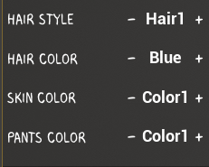

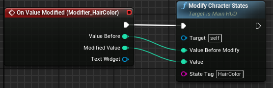

下面的代码用于将修改的数据保存到 `GameSave` 中的一个属性中。`UMainMenuSaveGame`是自定义的继承自`USaveGame` 的类。

```C++
if (!Save) Save = Cast<UMainMenuSaveGame>(UGameplayStatics::CreateSaveGameObject(UMainMenuSaveGame::StaticClass()));
Save->StyleConfigs.Add(FName(Tag), Index);							
UGameplayStatics::SaveGameToSlot(Save, "MainMenu", 0);
```

`UMainMenuSaveGame`类对应的代码。该类中只要一个属性,是一个 TMap 类型，其中 Key 对应的 FName 表示的是 `Table_CharacterStyleConfig` 中的 RowName,而 int 保存的是具体改变的是哪个网格或者颜色。在这里使用 TMap 是一个很好选择，key 不能重复，避免重复添加 FName。

```C++
UPROPERTY()
	TMap<FName,int> StyleConfigs; 
```

## 接口

在本项目使用到接口的地方比较多，在这里首先对于在 C++ 中创建的接口进行解释。使用接口的目的是为了让项目的结构的更加的清晰，更容易理解，方便项目后期的拓展和维护。

接口的代码都在 `Interfaces` 文件夹中。在本项目中使用的都是虚幻引擎本身封装的接口，除了虚幻引擎本身之外，C++ 本身也有原生的接口。出于本项目的功能考虑，最终选择了使用虚幻引擎的接口。

### AssociatedComponentGetter

**头文件**

接口一般都只有头文件中写代码，也就是只有声明没有实现，实现都在接口的继承中，这样做是多态的一种体现。在实现接口的时候需要注意的是需要继承`IAssociatedComponentGetter`类而不是`UAssociatedComponentGetter`。

```C++
// Easy Systems

#pragma once

#include "CoreMinimal.h"
#include "UObject/Interface.h"
#include "AssociatedComponentGetter.generated.h"

// This class does not need to be modified.
UINTERFACE(MinimalAPI)
class UAssociatedComponentGetter : public UInterface
{
	GENERATED_BODY()
};

class EASYSURVIVALRPGV2_5_API IAssociatedComponentGetter
{
	GENERATED_BODY()

public:
	UFUNCTION(BlueprintNativeEvent,BlueprintCallable)
		class UInventoryComponent* GetInventoryComponent();  // 获取背包组件

	UFUNCTION(BlueprintNativeEvent,BlueprintCallable)
	    class UInventoryComponent* GetHotBarComponent();	// 得到快捷栏组件

	UFUNCTION(BlueprintNativeEvent,BlueprintCallable)
		class UDelegateComponent* GetDelegateComponent();    // 获取委托组件

	UFUNCTION(BlueprintNativeEvent,BlueprintCallable)
		class UCraftingComponent* GetCraftingComponent();	 // 获取工艺组件
};
```

本接口的功能从接口的名字的字面意思也可以看出来，是获取相关组件。组件可以根据自己的需求挂在任何 Actor 的身上。但在本项目中除了委托组件外，其它的都只挂在玩家身上。

### GameUIDataProvider

该接口专门用于给游戏的 UI  界面提供数据。

```C++
#pragma once

#include "CoreMinimal.h"
#include "UObject/Interface.h"
#include "Types/ItemsSysType.h"
#include "GameUIDataProvider.generated.h"

UINTERFACE(MinimalAPI)
class UGameUIDataProvider : public UInterface
{
	GENERATED_BODY()
};

class EASYSURVIVALRPGV2_5_API IGameUIDataProvider
{
	GENERATED_BODY()
public:
	UFUNCTION(BlueprintNativeEvent,BlueprintCallable)
		int32 GetPlayerInventoryCapacity();             
    
	UFUNCTION(BlueprintNativeEvent,BlueprintCallable)
		FInventoryItemData GetItemData(int32 Index);     // 获取背包中某一项数据
    
	UFUNCTION(BlueprintNativeEvent,BlueprintCallable)
		FInventoryItemData GetHotBarItemData(int32 Index); // 得到快捷栏背包里面的道具信息
    
	UFUNCTION(BlueprintNativeEvent,BlueprintCallable)
		TArray<FName> GetCraftingList(EItemCategory& Category);  

	UFUNCTION(BlueprintNativeEvent,BlueprintCallable)
		int32 GetCraftingListQueueLength();

	UFUNCTION(BlueprintNativeEvent,BlueprintCallable)
		bool GetProcessingCraftingData(int32 Index, FName& CraftingRowName, int32& Amount);
};
```

在该接口中通过字面意思基本上就会知道此函数的作用了。

### InteractiveObject

该接口用于处理射线检测到物体时的交互。只有实现了该接口的类才可以交互。

```C++
UFUNCTION(BlueprintNativeEvent)
    void BeginInteractive(APlayerController* Controller);        // 开始交互

UFUNCTION(BlueprintNativeEvent)
    void EndInteractive(APlayerController* Controller);          // 结束交互

UFUNCTION(BlueprintNativeEvent)
    void InteractiveResponse(APlayerController* Controller);     // 交互后的对面的反应

UFUNCTION(BlueprintNativeEvent)
    bool GetInteractiveInformation(FString& Title,FString& Summary,FString& Tip);     // 得到交互信息的文字提示
```

### OperativeItem

该接口用于可操作的物体使用武器或工具进行攻击时的行为。

```C++
UFUNCTION(BlueprintNativeEvent)
	void MainActionOperative(USkeletalMeshComponent* OperatingActorMesh);    // USkeletalMeshComponent 使用这个参数主要是为了动画
UFUNCTION(BlueprintNativeEvent)
	bool CanBeOperated();               // 是否能够操作它
UFUNCTION(BlueprintNativeEvent)
	void EndOperating();
```

### CameraDataGetter

摄像机数据获得者。

下面的接口函数是获得摄像机的投射数据。在本项目中摄像机在玩家身上，因此玩家实现了该接口，并在重写的函数中返回了摄像机的位置和旋转。

```C++
UFUNCTION(BlueprintNativeEvent, BlueprintCallable)
		void GetCameraProjectData(FVector& WorldLocation, FRotator& Orientation);
```

## 游戏界面

在当前游戏中实现的功能主要有背包系统，工艺系统和建造系统，下面将单独介绍每个系统的实现。

当选择好人物的样式后，点击开始游戏后将进入到游戏页面。此时将切换关卡。由于 `GameMode` 逻辑游戏场景和主菜单关卡的逻辑不相同,因此在新的关卡设置了新 `GameMode`。

为了让整个文档的结构更加的清晰，当介绍到某个类时，先列出该类的源文件和头文件。只是适当说明部分属性和函数。对于函数具体的功能，将在后面具体的模块功能时通过线性的方式进行介绍。

### GameMode

在 C++ 实现角色类 `PlayerCharacter`类和玩家控制器类 `PiratePlayerController` 。功能基本都在 C++ 中实现，然后派生出蓝图子类。`BP_PlayerCharacter`,和`BP_PirateGamePlayerController`类。GameMode 直接写的是蓝图子类 `BP_PirateGameplayGameMode` ，没有写 C++ 父类。

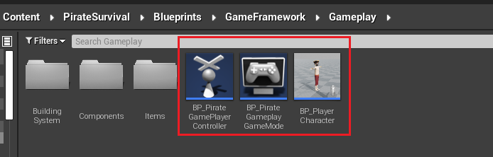

### PlayCharacter

**源文件**

```C++
// Easy Systems

#pragma once

#include "CoreMinimal.h"
#include "GameFramework/Character.h"
#include "Gameplay/PirateCharacterBase.h"
#include "Gameplay/Interfaces/AssociatedComponentGetter.h"
#include "Global/GlobalDelegateManager.h"
#include "Types/ItemsSysType.h"

#include "PlayerCharacter.generated.h"

UCLASS()
class EASYSURVIVALRPGV2_5_API APlayerCharacter : public APirateCharacterBase,public IAssociatedComponentGetter
{
	GENERATED_BODY()

public:
	// Sets default values for this character's properties
	APlayerCharacter();

protected:
	// Called when the game starts or when spawned
	virtual void BeginPlay() override;

	UPROPERTY(VisibleAnywhere,BlueprintReadOnly)
		USkeletalMeshComponent* HeadMesh;
	UPROPERTY(VisibleAnywhere, BlueprintReadOnly)
		USkeletalMeshComponent* BodyMesh;
	UPROPERTY(VisibleAnywhere, BlueprintReadOnly)
		USkeletalMeshComponent* HandsMesh;
	UPROPERTY(VisibleAnywhere, BlueprintReadOnly)
		USkeletalMeshComponent* LegsMesh;
	UPROPERTY(VisibleAnywhere, BlueprintReadOnly)
		USkeletalMeshComponent* FeetMesh;

	UPROPERTY(EditAnywhere)
		FGameplayTag SwapItemEventTag;   // 交换道具的委托标签
	UPROPERTY(EditAnywhere)
		FGameplayTag SplitItemEventTag;  // 分堆道具的委托标签
	UPROPERTY(EditAnywhere)
		float SpringSpeed = 600.f;         
	UPROPERTY(EditAnywhere)
		float RunSpeed = 450.f;
	UPROPERTY(EditAnywhere)
		FName WeaponSocketName = NAME_None;
	UPROPERTY(EditAnywhere)
		TSubclassOf<class AWeaponAndTool> WeaponToolClass;
	UPROPERTY(BlueprintReadOnly)
		UObject* HotBarItem;
    
	class AWeaponAndTool* HoldingWeapon;
	bool bFastMoving = false;             // 是否快速移动
	int32 HotBarIndex = -1;               // 快捷道具栏的索引

	UFUNCTION()
		void PlayerSwapItems(UObject* Payload);
	UFUNCTION()
		void PlayerSplitItems(UObject* Payload);

	UFUNCTION(BlueprintImplementableEvent)
		void HotBarSelected(class UInventoryComponent* HotBarComp,int32 Index); // 虚幻引擎会通过调用代理通过蓝图去调用  

	void LoadSavedStyle();                      // 加载已保存的样式
	void HandleFastMovingSwitch();              // 处理快速移动的切换

	void HandleWeaponAndToolSelected(const FItemDataTableRow& ItemData, FName RowName);  // 选中哪个武器或者装备

public:	
	// Called every frame
	virtual void Tick(float DeltaTime) override;

	// Called to bind functionality to input
	virtual void SetupPlayerInputComponent(class UInputComponent* PlayerInputComponent) override;

	// 控制人物的移动
	void LookUp(float Axis);
	void Turn(float Axis);
	void MoveForward(float Axis);
	void MoveRight(float Axis);
	void SpringOrFastSwim();
	void SelectHotBar(FKey Key);  // 快捷栏选择
	void MainAction();       // 当前的快捷栏里面不管选的是什么道具,按鼠标左键都时使用我选择的那个道具

	UFUNCTION(BlueprintCallable)
		void EndOperatingItem();
};
```

玩家进入到游戏关卡以后,将展示如图所示的界面。此时玩家可以移动，并且在下面会展示快捷栏。

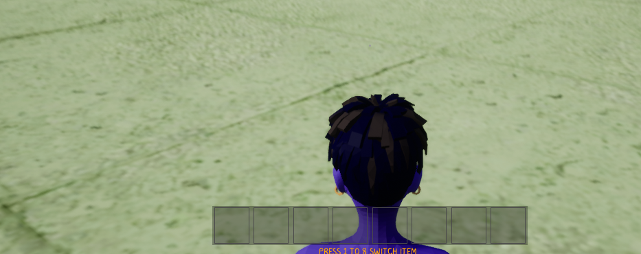

下面将简单的介绍一下该玩家中头文件中一些重点的变量和函数。

1. 由于人物是通过多个部分拼接起来的，下面的代码是声明每个部件的骨骼组件。

```C++
UPROPERTY(VisibleAnywhere,BlueprintReadOnly)
USkeletalMeshComponent* HeadMesh;
... 此处省略多行
```

2. 玩家的移动和视角的变换。

重写父类的下面的函数。

```C++
virtual void SetupPlayerInputComponent(class UInputComponent* PlayerInputComponent) override;
```

在源代码中绑定轴事件和 Acion 事件。

```C++
void APlayerCharacter::SetupPlayerInputComponent(UInputComponent* PlayerInputComponent)
{
	Super::SetupPlayerInputComponent(PlayerInputComponent);
	PlayerInputComponent->BindAxis(TEXT("MoveForward"), this, &APlayerCharacter::MoveForward);
    ...省略多行
        
	PlayerInputComponent->BindAction(TEXT("Sprint/FastSwim"), EInputEvent::IE_Pressed, this, &APlayerCharacter::SpringOrFastSwim);
    ...省略多行
    
}
```

在绑定的轴事件中,调用的是 `BindAxis` 函数，第一个参数 `TEXT("MoveForward")` 对应的是在项目设置中 `Input` 选项中进行设置的。&APlayerCharacter::MoveForward`是点击该键将触发的函数。其它的类似。

### PiratePlayerController

玩家控制器。玩家控制器实现的主要功能是射线检测。也就是和各种物体的交互。在本项目中由于玩家控制器实现的功能比较单一，因此在此处对于玩家控制器的代码进行比较完整的介绍。

**头文件**

```C++
#pragma once

#include "CoreMinimal.h"
#include "GameFramework/PlayerController.h"
#include "PiratePlayerController.generated.h"

UCLASS()
class EASYSURVIVALRPGV2_5_API APiratePlayerController : public APlayerController
{
	GENERATED_BODY()
private:
	void Tick(float DeltaSeconds) override;
	void SetupInputComponent() override;
	void Interact();

	// 更新交互检测 从弹簧臂开始检测
	void UpdateInteractiveTrace();

	/// <summary>
	/// 对物体进行描边
	/// </summary>
	/// <param name="Actor"></param>
	/// <param name="bShowOutLine">是否展示描边</param>
	void SetActorOutLine(AActor* Actor, bool bShowOutLine);
	
protected:
	UPROPERTY(BlueprintReadOnly)
		// 已经被交互到的 Actor
		AActor* InteractiveActor;
	
	UPROPERTY(EditDefaultsOnly)
		TEnumAsByte<ETraceTypeQuery> InteractiveTraceChannal; // 检测通道
	
	UPROPERTY(EditDefaultsOnly)
		float InteractiveTraceRange = 180.f;                 // 检测范围
};
```

**源文件**

```C++
// Easy Systems 


#include "Gameplay/PiratePlayerController.h"
#include "GameFramework/SpringArmComponent.h"
#include "Kismet/GameplayStatics.h"
#include "Gameplay/Interfaces/InteractiveObject.h"
#include "Global/GlobalDelegateManager.h"
#include "Gameplay/Interfaces/AssociatedComponentGetter.h"


void APiratePlayerController::Tick(float DeltaSeconds) 
{
	Super::Tick(DeltaSeconds);

	UpdateInteractiveTrace();
}

void APiratePlayerController::SetupInputComponent() 
{
	Super::SetupInputComponent();

	InputComponent->BindAction(TEXT("Interact"), EInputEvent::IE_Pressed,this,&APiratePlayerController::Interact);
}

void APiratePlayerController::Interact()
{
	if (IsValid(InteractiveActor) && InteractiveActor->Implements<UInteractiveObject>())
		IInteractiveObject::Execute_InteractiveResponse(InteractiveActor, this);
}

void APiratePlayerController::UpdateInteractiveTrace()
{
	FVector WorldLocation;
	FRotator Orientation;

	if (GetPawn()->Implements<UAssociatedComponentGetter>())
		IAssociatedComponentGetter::Execute_GetCameraProjectData(GetPawn(), WorldLocation, Orientation);

	auto Start = WorldLocation;
	auto End = Start + Orientation.Vector() * InteractiveTraceRange;     // Orientation.Vector() 朝向的前方
    
	FHitResult OutHit;

	AActor* BeginInteractiveActor = NULL;           // 开始交互的 AActor
	AActor* EndInteractiveActor = NULL;				// 结束交互的 AActor
	AActor* TracingInteractiveActor = NULL;			// 每一帧正在交互的 AActor

	if (UKismetSystemLibrary::LineTraceSingle(GetWorld(), Start, End, InteractiveTraceChannal, false, { GetPawn() }, EDrawDebugTrace::ForOneFrame, OutHit, true))
	{
		TracingInteractiveActor = OutHit.GetActor();
		if (InteractiveActor != TracingInteractiveActor)       // 检测到了不一样的 AActor
		{
			BeginInteractiveActor = TracingInteractiveActor;   // 新的 AActor 开始交互
			EndInteractiveActor = InteractiveActor;
		}
	}
	else
		EndInteractiveActor = InteractiveActor;

	if (EndInteractiveActor && EndInteractiveActor->Implements<UInteractiveObject>())
	{
		IInteractiveObject::Execute_EndInteractive(EndInteractiveActor, this);        // 第一个参数为调用主体
		GlobalDelegateManager::Get()->CallGenericDelegate<void, bool, AActor*, FString, FString, FString>
			(INTERACTIVE_SHOW_INFO, false, NULL, "", "", "");
	}

	// BeginInteractiveActor->Implements<UInteractiveObject>() 用于判断是否实现某个接口
	if (IsValid(BeginInteractiveActor) && BeginInteractiveActor->Implements<UInteractiveObject>()) 
	{
		IInteractiveObject::Execute_BeginInteractive(BeginInteractiveActor, this); // request=> can see  again
		FString Title, Summary, Tip;
		auto bHasInfo = IInteractiveObject::Execute_GetInteractiveInformation(BeginInteractiveActor, Title, Summary, Tip); // 返回值是否显示交互信息
		GlobalDelegateManager::Get()->CallGenericDelegate<void, bool, AActor*,FString, FString, FString>
			(INTERACTIVE_SHOW_INFO,bHasInfo, BeginInteractiveActor, Title, Summary, Tip);
	}
	
	SetActorOutLine(BeginInteractiveActor, true);
	SetActorOutLine(EndInteractiveActor, false);

	InteractiveActor = TracingInteractiveActor;
}

void APiratePlayerController::SetActorOutLine(AActor* Actor, bool bShowOutLine)
{
	//UKismetSystemLibrary::PrintString(GetWorld());
	if (!IsValid(Actor)) return;
	TArray<UMeshComponent*> MeshComps;
	Actor->GetComponents(MeshComps);

	for (auto& Comp : MeshComps)
	{
		if(!bShowOutLine)
		{
			Comp->SetRenderCustomDepth(false);
			continue;
		}
		Comp->SetRenderCustomDepth(true);
		Comp->SetCustomDepthStencilValue(1); 
	}
}
```

在该类中主要函数是 `UpdateInteractiveTrace（）` 射线检测函数。该函数在 `Tick` 中每帧进行调用。

下面将逐步介绍该函数中实现的功能和逻辑。

* 在下面的代码中首先判断玩家有没有实现 `UCameraDataGetter`  ,避免直接调用导致报错。在通过接口调用接口函数时需要在接口函数的前面加上前缀`Execute_`。`GetPawn()` 为实现了该接口的玩家，最终通过接口将弹簧臂的世界坐标位置和和控制器的旋转得到通过引用的方式保存在局部变量 `WorldLocation` 和`Orientation` 中。

```C++
if (GetPawn()->Implements<UCameraDataGetter>())
	ICameraDataGetter::Execute_GetCameraProjectData(GetPawn(), WorldLocation, Orientation);
```


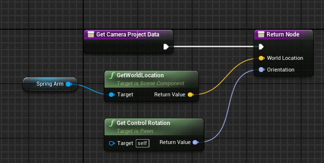


* 射线检测的核心函数

```C++
UKismetSystemLibrary::LineTraceSingle(GetWorld(), Start, End, InteractiveTraceChannal, false, { GetPawn() }, EDrawDebugTrace::ForOneFrame, OutHit, true)
```

 `GetWorld()`世界上下文对象。`Start`摄像检测的起始点。`End` 射线的终点。`InteractiveTraceChannal` 射线检测的通道。`false ` 不检测复杂碰撞。`{ GetPawn()}` 忽略的Actor。`EDrawDebugTrace::ForOneFrame` 每帧进行检测。`OutHit` 检测到物体的信息。`True` 忽略自己。


* 检测到物体高亮显示。调用自定义的`SetActorOutLine（）`

  ```C++
  SetActorOutLine(BeginInteractiveActor, true);
  ```

### 道具系统(背包系统)

背包系统主要是拾取道具，以及在背包中对于道具的交换分堆，将道具放入到快捷栏中。

在介绍背包系统前，首先介绍一下可拾取的类`ALootableItem`继承自 `Actor` ,该类是可拾取的类的记录。

#### 可拾取道具基类

**头文件**

可拾取的道具需要交互，因此需要实现可交互接口 `IInteractiveObject`。

```C++
// Easy Systems

#pragma once

#include "CoreMinimal.h"
#include "GameFramework/Actor.h"
#include "Gameplay/Interfaces/InteractiveObject.h"
#include "LootableItem.generated.h"

UCLASS()
class EASYSURVIVALRPGV2_5_API ALootableItem : public AActor,public IInteractiveObject
{
	GENERATED_BODY()
	
public:	
	// Sets default values for this actor's properties
	ALootableItem();

protected:
	// Called when the game starts or when spawned
	virtual void BeginPlay() override;

	UPROPERTY(VisibleAnywhere)
		UStaticMeshComponent* StaticMeshComp;        // 可拾取的道具可能是静态网格也可能是骨骼网格,因此定义两个变量
	UPROPERTY(VisibleAnywhere) 
		USkeletalMeshComponent* SkeletalMeshComp;

	UPROPERTY(EditInstanceOnly)
		FName ItemDataRowName;								// 道具表行的名字
	UPROPERTY(EditInstanceOnly,meta = (ClampMin = 1))       // note=> 用于限制最小值,到达最小值后不能继续减小了
		int32 ItemCount = 1;                                // 可拾取道具的数量

public:	
	// Called every frame
	virtual void Tick(float DeltaTime) override;

// 模仿 UObject 父类写的
#if WITH_EDITOR
private:
	// override from UOject
	virtual void PostEditChangeProperty(struct FPropertyChangedEvent& PropertyChangedEvent) override; 
#endif

private:
	void BeginInteractive_Implementation(APlayerController* Controller) override;
	void EndInteractive_Implementation(APlayerController* Controller) override;
	void InteractiveResponse_Implementation(APlayerController* Controller) override;
	bool GetInteractiveInformation_Implementation(FString& Title,FString& Summary,FString& Tip) override;
};
```

**源文件**

```C++
// Easy Systems
// 

#include "Gameplay/ItemSystem/LootableItem.h"
#include "Kismet/GameplayStatics.h"
#include "Types/ItemsSysType.h"
#include "Utils/CommonUtilLibrary.h"
#include "Gameplay/Interfaces/AssociatedComponentGetter.h"
#include "Gameplay/ItemSystem/InventoryComponent.h"

// Sets default values
ALootableItem::ALootableItem()
{
 	// Set this actor to call Tick() every frame.  You can turn this off to improve performance if you don't need it.
	PrimaryActorTick.bCanEverTick = true;

	SetRootComponent(CreateDefaultSubobject<USceneComponent>(TEXT("Root")));
	StaticMeshComp = CreateDefaultSubobject<UStaticMeshComponent>(TEXT("StaticMeshComp"));
	StaticMeshComp->SetupAttachment(RootComponent);
	StaticMeshComp->SetCollisionEnabled(ECollisionEnabled::NoCollision);
	SkeletalMeshComp = CreateDefaultSubobject<USkeletalMeshComponent>(TEXT("SkeletalMeshComp"));
	SkeletalMeshComp->SetupAttachment(RootComponent);
	SkeletalMeshComp->SetCollisionEnabled(ECollisionEnabled::NoCollision);
}

// Called when the game starts or when spawned
void ALootableItem::BeginPlay()
{
	Super::BeginPlay();
	
}

// Called every frame
void ALootableItem::Tick(float DeltaTime)
{
	Super::Tick(DeltaTime);

}

#if WITH_EDITOR
void ALootableItem::PostEditChangeProperty(FPropertyChangedEvent& PropertyChangedEvent)
{
	
	if (PropertyChangedEvent.GetPropertyName() == TEXT("ItemDataRowName"))                  // PropertyChangedEvent.GetPropertyName() 
	{
		if (auto ItemData  = UCommonUtilLibrary::GetTableRow<FItemDataTableRow>(TEXT("ItemTable"), ItemDataRowName)) 
		{
			if (IsValid(ItemData->Model_SM)) 
			{
				StaticMeshComp->SetStaticMesh(ItemData->Model_SM);
				StaticMeshComp->SetCollisionEnabled(ECollisionEnabled::QueryAndPhysics);
				StaticMeshComp->SetSimulatePhysics(true);
			}
			if (IsValid(ItemData->Model_Sk)) 
			{
				SkeletalMeshComp->SetSkeletalMesh(ItemData->Model_Sk);
				SkeletalMeshComp->SetCollisionEnabled(ECollisionEnabled::QueryAndPhysics);
				SkeletalMeshComp->SetSimulatePhysics(true);
			}
		}
		else
		{
			StaticMeshComp->SetStaticMesh(NULL);
			StaticMeshComp->SetCollisionEnabled(ECollisionEnabled::NoCollision);
			StaticMeshComp->SetSimulatePhysics(false);
			SkeletalMeshComp->SetSkeletalMesh(NULL);
			SkeletalMeshComp->SetCollisionEnabled(ECollisionEnabled::NoCollision);
			SkeletalMeshComp->SetSimulatePhysics(false);
		}
	}

	Super::PostEditChangeProperty(PropertyChangedEvent);         // ?????????涼????
	//UKismetSystemLibrary::PrintString(GetWorld(), PropertyChangedEvent.GetPropertyName().ToString());
}
#endif
void ALootableItem::BeginInteractive_Implementation(APlayerController* Controller)
{

}
void ALootableItem::EndInteractive_Implementation(APlayerController* Controller)
{
}
void ALootableItem::InteractiveResponse_Implementation(APlayerController* Controller)
{
	auto Pawn = Controller->GetPawn();
	if (IsValid(Pawn) && Pawn->Implements<UAssociatedComponentGetter>()) 
	{
		auto Inventory = IAssociatedComponentGetter::Execute_GetInventoryComponent(Pawn);
		auto Left = Inventory->AddItemToInventory(ItemDataRowName, ItemCount);
		if (Left == 0) 
		{
			Destroy();
			return;
		}

		ItemCount = Left;
	}
}
bool ALootableItem::GetInteractiveInformation_Implementation(FString& Title, FString& Summary, FString& Tip)
{
	if (auto ItemData = UCommonUtilLibrary::GetTableRow<FItemDataTableRow>(TEXT("ItemTable"), ItemDataRowName)) 
	{
		Title = FString::Printf(TEXT("%s (%d)"), *ItemData->ItemName.ToString(), ItemCount);
		Summary = ItemData->Description.ToString();
		Tip = TEXT("Press [F] to Pick Up");
		return true;
	}
	return false;
}
```

1. 在编辑器状态下通过输入道具表的 `RowName` 值通过查表的方式确定生成道具。在宏`#if WITH_EDITOR`和宏`#endif`中间的可以在编辑器状态下执行。

   在这里重写父类的`PostEditChangeProperty`函数。派生该类的蓝图子类`BP_LootableItem`。在编辑器状态下，当将该类拖到地图中时，在该蓝图实例的细节面板中。有下面的属性`ItemDataRowName`(对应道具表中道具的 RowName 也就是主键)和`ItemCount`  （当前道具的堆叠数量）属性。而`PropertyChangedEvent.GetPropertyName()` 可以获得属性。当在 `ItemDataRowName` 中添加道具表中某个道具的`RowName`（相当于表的主键）值时。在地图中该蓝图的静态网格或者骨骼网格将会被设置成该道具的骨骼展示在地图中。

   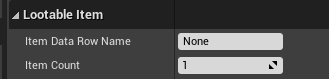

2. 由于该类实现了 `IInteractiveObject` 了该接口。因此需要重写该接口的所有方法。这些方法将射线和道具交互时触发。

   ```C++
   void BeginInteractive_Implementation(APlayerController* Controller) override;
   ...
   ```


#### 背包组件

`InventoryComponent`。背包组件挂在玩家的身上。背包组件的功能就是对于背包中道具的一些基本的操作，如交换道具，改变背包道具的位置，对道具进行分堆等操作。并将背包中的道具保存到 Json 文件中。背包组件派生了蓝图子类 `BP_InventoryComponent`，并将该组件挂在玩家的身上。并且可以在蓝图子类中修改一些暴露在蓝图中可以编辑的属性。

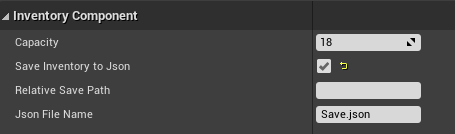

**头文件**

```C++
// Easy Systems

#pragma once

#include "CoreMinimal.h"
#include "Components/ActorComponent.h"
#include "Types/ItemsSysType.h"
#include "InventoryComponent.generated.h"


// note=> 只有动态委托才可以使用 UPROPERTY 的标记，只有动态的多波委托才可以在蓝图里面进行绑定
DECLARE_DYNAMIC_MULTICAST_DELEGATE_OneParam(FInventoryUpdateDelegate, int32, Index);  // 动态的委托虽然只有一个参数但是类型和标识符都要声明出来

UCLASS( Blueprintable,ClassGroup=(Custom), meta=(BlueprintSpawnableComponent) )
class EASYSURVIVALRPGV2_5_API UInventoryComponent : public UActorComponent
{
	GENERATED_BODY()

public:	
	// Sets default values for this component's properties
	UInventoryComponent();

protected:
	// Called when the game starts
	virtual void BeginPlay() override; 

	UPROPERTY(EditAnywhere,meta= (ClampMin=1) )
		int32 Capacity = 18;                    // 容量

	UPROPERTY(EditAnywhere)
		bool bSaveInventoryToJson = false;
	UPROPERTY(EditAnywhere)
		FString RelativeSavePath = "";
	UPROPERTY(EditAnywhere)
		FString JsonFileName = "Save.json";

	
public:	
	// Called every frame
	virtual void TickComponent(float DeltaTime, ELevelTick TickType, FActorComponentTickFunction* ThisTickFunction) override;

	UFUNCTION(BlueprintPure)
		FORCEINLINE int32 GetCapacity() { return Capacity; }
	UFUNCTION(BlueprintPure)
		bool GetItemData(int32 Index, FInventoryItemData& OutData);    //  返回值用于判断是否超出范围  
	/*
	* 确定数量的道具是否足够
	* @ItemRowName 道具的名字
	* @Amount 看道具够不够
	*/
	UFUNCTION(BlueprintPure)
		bool IsItemEnouph(FName ItemRowName,int32 Amount);
	UFUNCTION(BlueprintCallable)
		/// <summary>
		/// 向背包中添加道具
		/// </summary>
		/// <param name="ItemRowName">道具行的名字</param>
		/// <param name="Count">捡起的道具的数量</param>
		/// <param name="FromStackIndex">堆叠的索引</param>
		/// <param name="FromEmptyIndex">空的索引</param>
		/// <param name="">是否真的往里面添加道具</param>
		/// <returns>将捡起来的道具添加后剩余具后剩余的数量</returns>
		int32 AddItemToInventory(FName ItemRowName, int32 Count, int32 FromStackIndex = 0, int32 FromEmptyIndex = 0,bool bAddTest = false);
	
	/*
	* @Return int32 从背包中移除后还剩多少道具 
	*/
	UFUNCTION(BlueprintCallable)
		int32 RemoveIndexFromInventory(int32 Index,int32 Count); // 移除某个特定索引处的道具  移除多少个道具

	UFUNCTION(BlueprintCallable)
		int32 RemoveItemFromInventory(FName ItemRowName,int32 Count);
	UFUNCTION(BlueprintCallable)
		void SwapItems(int32 FromIndex,int32 ToIndex);     // 交换道具
	UFUNCTION(BlueprintCallable)
		void SplitItems(int32 FromIndex,int32 ToIndex,int SplitCount);   // 从哪个格子分割到哪个格子以及分割的数量
	UFUNCTION(BlueprintCallable)
		void PostInventoryInitiate();                    
	UFUNCTION(BlueprintCallable)
		void ClearAll();

	UPROPERTY(BlueprintAssignable)                         // BlueprintAssignable  这个标识符表示蓝图可以绑定
		FInventoryUpdateDelegate OnInventoryUpdated; 

	

private:
	// meta = (SavaToJson) 此时的名字是自定义的
	UPROPERTY(Meta = (SavaToJson = True))
		TArray<FInventoryItemData> InventoryItems;              // 背包,保存背包中的每一项数据
	void ConfirmInventorySlotChange(int Index, FInventoryItemData NewData);
	int32 InternalRemoveItemFromInventory(int32 Index, int32 Count); 
};
```

**源文件**

```C++
// Easy Systems


#include "Gameplay/ItemSystem/InventoryComponent.h"
#include "Utils/CommonUtilLibrary.h"
#include "Global/GlobalDelegateManager.h"
#include "JsonUtilities/Public/JsonUtilities.h"

// Sets default values for this component's properties
UInventoryComponent::UInventoryComponent()
{
	// Set this component to be initialized when the game starts, and to be ticked every frame.  You can turn these features
	// off to improve performance if you don't need them.
	PrimaryComponentTick.bCanEverTick = true;
	
	//下面的代码用于测试
	/*InventoryItems.Add(FInventoryItemData(TEXT("10001"), 5));
	InventoryItems.Add(FInventoryItemData(TEXT("10002"), 1));
	InventoryItems.Add(FInventoryItemData(TEXT("10003"), 3));	*/
	// ...
}

// Called when the game starts
void UInventoryComponent::BeginPlay()
{
	Super::BeginPlay();

	// ..
}

// Called every frame
void UInventoryComponent::TickComponent(float DeltaTime, ELevelTick TickType, FActorComponentTickFunction* ThisTickFunction)
{
	Super::TickComponent(DeltaTime, TickType, ThisTickFunction);

	// ...
}

bool UInventoryComponent::GetItemData(int32 Index, FInventoryItemData& OutData)
{
	OutData = FInventoryItemData();
	if(!InventoryItems.IsValidIndex(Index)) return false;
	OutData = InventoryItems[Index];
	if (OutData.Count == 0)return false;
	return true;
}

bool UInventoryComponent::IsItemEnouph(FName ItemRowName, int32 Amount)
{
	int32 HasAmount = 0;

	for (auto& Item : InventoryItems)
	{
		if (Item.TableRowName == ItemRowName)
			HasAmount += Item.Count;
	}

	// 够用
	return HasAmount >= Amount;
}
	
int32 UInventoryComponent::AddItemToInventory(FName ItemRowName, int32 Count, int32 FromStackIndex, int32 FromEmptyIndex,bool bAddTest)
{
	auto ItemTableData = UCommonUtilLibrary::GetTableRow<FItemDataTableRow>(TEXT("ItemTable"), ItemRowName);
	if (!ItemTableData) return Count;    // 添加的道具不存在直接返回,这种情况基本上不会出现,为了严谨而写

	// 添加道具需要满足下面的条件
	FInventoryItemData OutData;
	bool IsHasItem = false;
	int IndexToPut = -1;

	// 搜索可以堆叠的格子
	for (int i = FromStackIndex; i < Capacity && FromStackIndex < Capacity; i++)
	{ 
		IsHasItem = GetItemData(i, OutData);      // 是否有道具
		FromStackIndex = i;

		// 找到相同的道具,尝试堆叠
		if (IsHasItem && OutData.TableRowName == ItemRowName) 
		{
			IndexToPut = i;
			break;
		}
	}

	// 搜索空的格子
	for (int i = FromEmptyIndex; i < Capacity && IndexToPut < 0; i++)
	{
		IsHasItem = GetItemData(i, OutData);      // 是否有道具
		FromEmptyIndex = i;
		if (!IsHasItem)
			IndexToPut = i;
	}

	if (IndexToPut < 0) return Count;              // 即没有找到的空的格子也没有找到可以堆叠的

	auto InventoryCount = OutData.Count;                               // 背包中现有的道具的数量
	auto MaxCountCanPut = ItemTableData->MaxStack - InventoryCount;    // 这个格子最多能放多少
	auto LeftCount = Count - MaxCountCanPut;                           // 还剩多少放不进去

	if (MaxCountCanPut > 0)
	{
		if (LeftCount < 0) LeftCount = 0;

		OutData.Count += Count - LeftCount;
		OutData.TableRowName = ItemRowName;
		if(!bAddTest) ConfirmInventorySlotChange(IndexToPut, OutData);
	}
	else
		FromStackIndex++;


	// 递归调用
	if (LeftCount > 0)
		return AddItemToInventory(ItemRowName, LeftCount, FromStackIndex, FromEmptyIndex);

	return 0;
}

int32 UInventoryComponent::InternalRemoveItemFromInventory(int32 Index,int32 Count)
{
	FInventoryItemData Data;

	GetItemData(Index, Data);

	if (!Data.IsEmpty())
	{
		// 计算当此移除操作不可移除的数量
		auto AmountCanRemove = Count - Data.Count; 
		// 如果不可移除数量为负,则视为没有不可移除数量
		if (AmountCanRemove < 0)AmountCanRemove = 0;
		// 实际移除数量为待移除数量减不可移除的数量
		Data.Count -= Count - AmountCanRemove;
		ConfirmInventorySlotChange(Index, Data);	
		return AmountCanRemove; 
	}

	return Count;
}

int32 UInventoryComponent::RemoveIndexFromInventory(int32 Index, int32 Count)
{
	return InternalRemoveItemFromInventory(Index, Count);
}

int32 UInventoryComponent::RemoveItemFromInventory(FName ItemRowName, int32 Count)
{
	for (int32 i = 0; i < InventoryItems.Num(); i++)
	{
		if (InventoryItems[i].TableRowName == ItemRowName && InventoryItems[i].Count > 0)
		{
			Count = InternalRemoveItemFromInventory(i, Count);
			if(Count == 0) break;
		}
	}
	
	return Count;
}

void UInventoryComponent::SwapItems(int32 FromIndex, int32 ToIndex)
{
	// 把一个格子的道具放到另外的一个格子里面去
	// 可能性 1.放到一个空的格子里面去 2.两个格子的道具是同一种 3.两个格子的道具不一样
	// note=> 解决方式:要么分情况讨论,要么将所有的可能性都统一实现

	check(FromIndex >= 0 && FromIndex < Capacity && ToIndex >= 0 && ToIndex < Capacity);

	FInventoryItemData FromItemData, ToItemData;
	GetItemData(FromIndex, FromItemData);
	GetItemData(ToIndex, ToItemData);

	if (FromItemData.IsEmpty()) return;

	if (ToItemData.TableRowName != FromItemData.TableRowName) // 不一样的道具,两个空的也是不相同的
	{
		
		ConfirmInventorySlotChange(ToIndex, FromItemData);
		ConfirmInventorySlotChange(FromIndex, ToItemData);
	}
	else // 一样的道具
	{
		if (FromIndex == ToIndex) return;      // 避免重复放回自己的位置
		auto ItemTableData = UCommonUtilLibrary::GetTableRow<FItemDataTableRow>(TEXT("ItemTable"), FromItemData.TableRowName);
		if (!ItemTableData) return;

		auto FromLeft = FromItemData.Count + ToItemData.Count - ItemTableData->MaxStack;
		if (FromLeft < 0) FromLeft = 0;
		ToItemData.Count += FromItemData.Count - FromLeft;
		FromItemData.Count = FromLeft;

		ConfirmInventorySlotChange(FromIndex, FromItemData);
		ConfirmInventorySlotChange(ToIndex, ToItemData);
	}

}

void UInventoryComponent::SplitItems(int32 FromIndex, int32 ToIndex, int SplitCount)
{
	check(FromIndex >= 0 && FromIndex < Capacity&& ToIndex >= 0 && ToIndex < Capacity);

	FInventoryItemData FromItemData, ToItemData;
	GetItemData(FromIndex, FromItemData);
	GetItemData(ToIndex, ToItemData);

	//  必选是空的才可以分割
	if (!ToItemData.IsEmpty() || FromItemData.Count < SplitCount) return;

	FromItemData.Count -= SplitCount;
	ToItemData.TableRowName = FromItemData.TableRowName;
	ToItemData.Count += SplitCount;

	ConfirmInventorySlotChange(FromIndex, FromItemData);
	ConfirmInventorySlotChange(ToIndex, ToItemData);

}

void UInventoryComponent::PostInventoryInitiate()
{
	// 从 json 文件中读取数据
	if (bSaveInventoryToJson)
	{
		auto Path = FPaths::ProjectContentDir() + RelativeSavePath + JsonFileName;
		UCommonUtilLibrary::LoadObjectPropertiesFromJsonFile(this, *Path);
	}

	for (int i = 0; i < Capacity; i++)
	{
		FInventoryItemData Data;
		GetItemData(i, Data);
		ConfirmInventorySlotChange(i, Data);
	}
}

void UInventoryComponent::ClearAll()
{
	auto Path = FPaths::ProjectContentDir() + RelativeSavePath + JsonFileName;
	UCommonUtilLibrary::ClearFile(*Path);
}

void UInventoryComponent::ConfirmInventorySlotChange(int Index, FInventoryItemData NewData)
{
	if (Index < 0 && Index >= Capacity)return; // 越界了直接返回

	if (!InventoryItems.IsValidIndex(Index)) InventoryItems.SetNum(Index + 1);
	InventoryItems[Index] = NewData;

	if (bSaveInventoryToJson)
	{
		auto Path = FPaths::ProjectContentDir() + RelativeSavePath + JsonFileName;
		UCommonUtilLibrary::SaveObjectPropertiesToJsonFile(this, *Path);
	}

	// 通知UI更新
	OnInventoryUpdated.Broadcast(Index);
}
```


在背包的头文件中声明了一个动态多播委托。在背包更新时执行。背包的容量通过变量的方式已经暴露给了蓝图，在蓝图中可以修改背包的容量。

下面将逐个介绍一些背包中的重点功能。


1. 添加道具到背包中

当射线交互到可交互的道具，并且玩家点击拾取按钮时，玩家控制器中通过接口的方式触发`LootableItem`类中的  `InteractiveResponse_Implementation`  函数。在该函数中调用 `AddItemToInventory` 函数。

添加道具到背包中的主要代码。此时返回的 `Left`  是添加玩后当背包装满时还剩余的道具的数量。`ItemDataRowName` 是道具的 `RowName` ,也就是主键。`ItemCount` 是当前检测到可拾取的道具的数量。

```C++
auto Inventory = IAssociatedComponentGetter::Execute_GetInventoryComponent(Pawn);
auto Left = Inventory->AddItemToInventory(ItemDataRowName, ItemCount);
```

#### 背包数据存档

将背包中的道具保存到存档中，当再次打开时之前的数据将不会消失。

在这里没有像之前一样将数据保存在`SaveGame` 中，而是将数据保存在`Json`中，是因为在实际的游戏中玩家背包中的数据可能是保存在服务端中的，而不是保存在玩家本地（保存在本地的话，玩家可以随意的修改，不是很安全）。并且通过服务器将数据传给客户端需要用到网络传输协议，而虚幻引擎的`SaveGame` 对象并不会直接的支持传输协议。

对于文件的读取将数据保存到 Json 文件中是通用的功能，因此将该功能通过静态函数的方式写在通用函数库中。

下面为函数的声明。其中参数 `UObject` 为需要保存数据的对象类型指针。`FileFullPath` 为 json 文件保存的路劲。`Flags ` 是为了后面的拓展做准备的。

```C++
static void SaveObjectPropertiesToJsonFile(UObject* Obj, const TCHAR* FileFullPath, int64 Flags = 0i64);
static void LoadObjectPropertiesFromJsonFile(UObject* Obj, const TCHAR* FileFullPath);
```

**源代码**

```C++
void UCommonUtilLibrary::SaveObjectPropertiesToJsonFile(UObject* Obj, const TCHAR* FileFullPath, int64 Flags)
{
	//UClass* Class = Obj->GetClass();
	TSharedRef<FJsonObject> JsonObj = MakeShareable(new FJsonObject);

	// 通过字段迭代器遍历字段 It 的 bool 值已经被重写了因此可以代表是否有效 
	for (TFieldIterator<FProperty> It(Obj->GetClass()); It; ++It) // 前面是构造器的简写方法
	{
		auto Property = *It;                                      // 对迭代器进行解引用得到需要迭代的东西
		if (Property->GetMetaData(TEXT("SaveToJson")) != TEXT("True")) continue;

		auto Value = FJsonObjectConverter::UPropertyToJsonValue(Property, Property->ContainerPtrToValuePtr<void>(Obj), Flags, 0i64);
		JsonObj->Values.Add(Property->GetName(), Value);
	}
	// 将 JsonObj 转换成 JsonStr 存到文件中
	FString JsonStr;
	FJsonSerializer::Serialize(JsonObj, TJsonWriterFactory<>::Create(&JsonStr));
	FFileHelper::SaveStringToFile(JsonStr, FileFullPath);
}
```

```C++
void UCommonUtilLibrary::LoadObjectPropertiesFromJsonFile(UObject* Obj, const TCHAR* FileFullPath)
{
	FString JsonStr;
	if (!FFileHelper::LoadFileToString(JsonStr, FileFullPath))return;

	TSharedPtr<FJsonObject> JsonObj;
	FJsonSerializer::Deserialize(TJsonReaderFactory<>::Create(JsonStr), JsonObj);

	for (TFieldIterator<FProperty> It(Obj->GetClass()); It; ++It) 
	{
		auto Property = *It;
		if (auto JsonValuePtr = JsonObj->Values.Find(Property->GetName())) 
		{
			void* ValuePtr = Property->ContainerPtrToValuePtr<void>(Obj);
			FJsonObjectConverter::JsonValueToUProperty(*JsonValuePtr, Property, ValuePtr, 0, 0);
		}
	}
}
```

在背包组件的头文件中，需要将数据保存到 Json 文件中属性通过 `UPROPERTY` 进行标记。由于在该类中只想将该变量保存到 Json 文件中。而在加载文件时其实是会遍历出所有的被 `UPROPERTY` 宏标记，因此通过在宏中添加属性 `Meta` ，在这里通过自定义一个  `(SaveToJson = True)` 键和值组成的属性。此时就可以通过判断宏中的属性 `Meta`  ，检查 SaveToJson 的值是否为 True,满足的就将数据保存到 Json 文件中。

```C++
UPROPERTY(Meta = (SaveToJson = True))
		TArray<FInventoryItemData> InventoryItems;
```

最终保存到 Json 文件中的内容如下所示。

```json
{
	"InventoryItems": [
		{
			"tableRowName": "20004",
			"count": 1,
			"duration": -1
		},
		{
			"tableRowName": "40001",
			"count": 20,
			"duration": -1
		},
	]
}
```

在上面实现了数据的读和写的功能。下面就可以在我们需要保存数据和读取数据的地方调用函数就可以了。这里的读和取数据其实是调用通用的函数后，函数帮我们将数据放在我们用`UPROPERTY` 标记，并且 `Meta` 属性为 `(Meta = (SaveToJson = True))` 的数组中。

**在本项目中的应用**

在游戏的过程，当点击保存游戏按键，将会弹出是否保存数据的面板。点击确定时通过调用组件中的保存数据的函数实现存档。

```C++
void UBuildingSystemComponent::SaveDataToJsonFile()
{
	auto Path = FPaths::ProjectContentDir() + RelativeSavePath + JsonFileName;
	UCommonUtilLibrary::SaveObjectPropertiesToJsonFile(this, *Path);
}
```

在游戏开始之前调用下面的函数实现将 Json 文件中的数据设置到存放道具的数组中。

```C++
UCommonUtilLibrary::LoadObjectPropertiesFromJsonFile(this, *Path);
```

#### 装备道具栏装备

道具被拾取以后，进入了背包中。此时可以通过鼠标右键的方式将道具添加到快捷栏中。此时可以根据快捷栏中道具栏的数量通过点击键盘中对应快捷栏项所对应的数字使用道具。

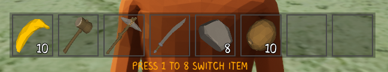

1. 当输入键盘中的数字 3 时。将触发 `PlayerCharacter` 类中的继承自父类中的函数。

   ```C++
   virtual void SetupPlayerInputComponent(class UInputComponent* PlayerInputComponent) override;
   ```

   在该函数中通过绑定轴事件绑定了数字 1 到 8。

   ```C++
   PlayerInputComponent->BindAction("NumbericShotcut", IE_Released, this, &APlayerCharacter::SelectHotBar);
   ```

   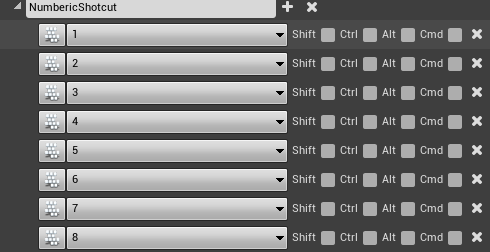

​	此时将触发该函数 `SelectHotBar`。该函数中实现的功能主主要两点

* 第一件事就是通知 UI 将被选择的道具项的框框高亮。

  首先通过通过接口调用得到快捷栏组件。

  ```C++
  auto HotBar = IAssociatedComponentGetter::Execute_GetHotBarComponent(this);
  ```

  然后调用下面的函数，下面的函数是蓝图实现的。将快捷栏组件和当前被选择的道具项的索引传给蓝图。

  ```C++
  HotBarSelected(HotBar, Index);
  ```

  下面为 `BP_PlayerCharacter` 中该函数的实现。

  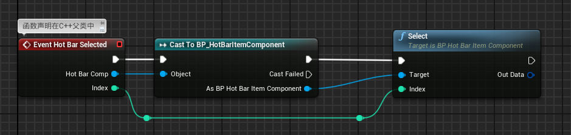

​	在上面可以看到将数据传到了 `Select` 函数中。`Select` 函数为 `BP_HotBarItemComponent`(道具栏组件中的函数)。

该函数的功能就是通过调用委托的方式方式将被选择的道具栏的索引传给 UI。

在`WBP_GameHUD` 中的 `Construt` 函数中绑定委托。这里使用的委托都是在 C++ 中自定义的挂在 `BP_PlayerCharacter` 中的委托组件。

由于在 `WBP_GameHUD` 中有 `WBP_HotBar` 控件。因此通过该控件的应用就可以很容易的让被选择的道具项高亮。

* 第二件事情就是在玩家的手上生成对应的道具。

这里通过武器和工具道具为例子进行讲述。

对于武器和工具创建了一个专门的 C++ 类 `WeaponAndTool`。

在函数刚开始的已经通过接口的方式获取了快捷栏组件。由于快捷栏组件和背包组件有许多相似的特性，因此快捷栏组件继承自背包组件。在背包组件中有一个获取背包中数据的函数 `GetItemData` ，该函数可以根据索引获取道具信息。

通过调用 `HandleWeaponAndToolSelected` 函数生成武器并且将武器吸附到手中某个插槽中。通过调用 `AWeaponAndTool` 中函数初始化设置网格。


==总结==

> 上面就是在使用快捷栏道具时的代码的运行过程。整个实现过程中主要 `Gameplay` 逻辑部分还是以 C++ 为主在设计到传传数据通知 UI 更新时为了方便回通过蓝图进行补充。并且在整个过程通过合理的使用接口和委托的方式让代码解耦，使逻辑更加的清晰。比如在获取组件的时候通过接口的方式获取组件。
>
> 在  C++ 中的 `Playercharacter` 通过接口的方式获取组件`auto HotBar = IAssociatedComponentGetter::Execute_GetHotBarComponent(this);`
>
> 在蓝图中的快捷栏组件中通过 `GetOwner` 调用接口函数的方式获取玩家身上的委托组件。像这两种方式其实都可以直接获取通过`Cast` 强制转换的方式转换为`BP_PlayerCharacter` 直接调用该类中获取组件的方式。像这种方式当组件换一个玩家可能最后的功能就无法进行了。
>
> 而在通知 UI 将被选择的道具项高亮时使用了委托。在道具栏组件中调用委托，在 `WBP_GameHUD` 中绑定委托。只要避免了对象的引用而不利于拓展。

#### 使用装备的道具

对于武器和工具可以用来攻击其它物体。有用来攻击石头的，有用来拆房子。

这里通过使用武器和工具类 `WeaponAndTool` 中的**Pickaxe** （镐头）类型柴矿石为例子。

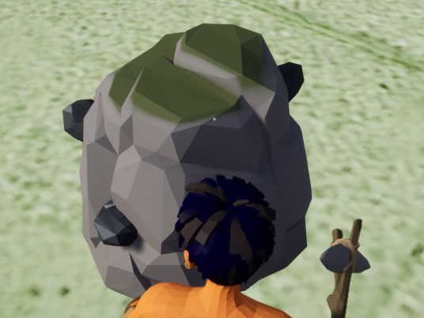

工具使用的是射线检测。

当玩家手中拿着武器,点击鼠标左键攻击。执行流程如下。

和装备道具时一样通过。

```C++
PlayerInputComponent->BindAction("HotBarMainAction", IE_Released, this, &APlayerCharacter::MainAction); 
```

触发 `MainAction` 函数。

在这里需要提到一个接口 `IoperativeItem` 。对于可操作的道具，如工具和武器需要实现该接口。

如果是可以操作的道具。则通过接口的方式执行该函数。其中`HotBarItem` 为当前正在使用的道具。并且将玩家的网格也传过去，通过玩家的网格组件播放攻击动画。

```C++
IOperativeItem::Execute_MainActionOperative(HotBarItem, HeadMesh);
```

在 `WeaponAndTool` 中的 `MainActionOperative_Implementation` 函数中。

通过刚才传进来的网格组件播放动画。`WeaponDataPtr`指针是在生成工具道具时就保存的。

```C++
OperatingActorMesh->GetAnimInstance()->PlaySlotAnimationAsDynamicMontage(WeaponDataPtr->MissAnim, MontageSlotName);
```

播放动画后将会播放`WeaponDataPtr->MissAnim` 查出来的动画序列。在动画序列中有三个动画通知。在前两个动画通知会执行的时候会改变一个该变一个布尔参数的值(是否结束伤害检测)。

* `AN_WeaponAndToolDamageTrace`    FInishTrace = false
* `AN_WeaponAndToolDamageTrace`    FInishTrace = true

共同执行一个通知类。通过`FinishTrace` 确定调用 `WeaponAndTool` 类中的 `StartDamageTracing` 函数还是 `EndDamageTracing` 函数。

当调用`StartDamageTracing` 函数时该函数将 `bDamageTracing` 设置为 `true` ,此时 **Pickaxe** 的道具将进行射线检测。

执行 `EndDamageTracing` 函数时在检测道到物体将会播放撞击动画。此外会通过`UGameplayStatics::ApplyDamage(Actor, WeaponDataPtr->BaseDamage, 0, this, 0); ` 函数给所有检测到物体应用伤害。

攻击的物体 `BP_` 会掉落资源，因此统一的继承自 C++ 资源类`AResourceActor`。 在该类中设置物体的一些属性，如生命值，可以攻击该资源的工具。

该资源基类中的构造函数中绑定了一个委托。当接收到伤害时触发。

```C++
OnTakeAnyDamage.AddDynamic(this,&AResourceActor::ResourceActorTakeDamage);
```

此时在该类中处理受到伤害之后的一系列事情。


* `AN_EndOperating`

通过攻击已经结束，当前攻击没有结束前无法进行下一下攻击。

### 建造系统

建造系统主要功能的实现在于 C++  中的两个类。

1. `BuildingPartActor.h` 这个是建造部件的基类。在该类中实现对于建造部件的一些属性的设置等操作。在该类的构造函数中实现对于静态网格的设置。

```C++
BuildingPartMesh = CreateDefaultSubobject<UStaticMeshComponent>(TEXT("BuildingPartMesh"));	SetRootComponent(BuildingPartMesh);
```

蓝图类实现该 C++ 基类。

2. `BuildingSystemComponent.h` 组件。该组件用于对于建造部件的操作。将一些通用的功能封装在一个组件中，有利于功能在其它的项目的复用。


### 委托组件

头文件

```C++
// Easy Systems

#pragma once

#include "CoreMinimal.h"
#include "Components/ActorComponent.h"
#include "GameplayTagContainer.h"

#include "UDelegateComponent.generated.h"

DECLARE_DYNAMIC_DELEGATE_OneParam(FCommonDelegate, UObject*, Payload);

UCLASS( ClassGroup=(Custom), meta=(BlueprintSpawnableComponent) )
class EASYSURVIVALRPGV2_5_API UDelegateComponent : public UActorComponent
{
	GENERATED_BODY()

public:	
	// Sets default values for this component's properties
	UDelegateComponent();

protected:
	// Called when the game starts  
	virtual void BeginPlay() override;

	UPROPERTY(EditAnywhere)
		TMap<FGameplayTag, FCommonDelegate> DelegateMap;
public:	
	// Called every frame
	virtual void TickComponent(float DeltaTime, ELevelTick TickType, FActorComponentTickFunction* ThisTickFunction) override;

	UFUNCTION(BlueprintCallable)
		/// <summary>
		/// 绑定委托
		/// </summary>
		/// <param name="DelegateTag">委托的名字</param>
		/// <param name="Obj">调用函数的主体,因为所有蓝图类型都是 UObject 的子类</param>
		/// <param name="FunctionName">由于函数的指针不支持 UFUNCTION 因此直接使用函数名，这个是动态委托比较特殊的地方</param>
		void BindDelegate(FGameplayTag DelegateTag, UObject* Obj, FName FunctionName);
	UFUNCTION(BlueprintCallable)
		void CallDelegate(FGameplayTag DelegateTag,UObject* payload);
};

// 这个是一个工具类用于获取蓝图中的数据
template<typename PropertyType>
PropertyType GetPropertyFromUObject(UObject* Obj,FString PropertyName) 
{

	/*
	* note=>
	*  1.所用用 UPROPERTY 标记的字段的反射信息都保存在该字段中，它是有子类的，
	*	是各种类型,比如FIntProperty(保存整数类型的反射信息),由于这里不知道传入的是什么类型因此用父类类型的迭代器
	*  2. ExcludeSuper 表示不包含父类的，包含父类的话，需要迭代的数据太多了,没必要
	*/
	for (TFieldIterator<FProperty> It(Obj->GetClass(), EFieldIteratorFlags::ExcludeSuper);It; ++It)
	{
		auto PropertyPtr = *It;
		if (PropertyPtr->GetName() == PropertyName)
		{
			if (auto ValuePtr = PropertyPtr->ContainerPtrToValuePtr<PropertyType>(Obj))
				return *ValuePtr;
		}
	}

	return  PropertyType();			  
}

#define PROPERTY_GET(Type,Indentifier,Obj) Type Indentifier;\
Indentifier = GetPropertyFromUObject<Type>(Obj,TEXT(#Indentifier))            // #Indentifier 加星号只是为了转换为字符串

```

源文件

```C++
// Easy Systems


#include "DelegateTest/UDelegateComponent.h"

// Sets default values for this component's properties
UDelegateComponent::UDelegateComponent()
{
	// Set this component to be initialized when the game starts, and to be ticked every frame.  You can turn these features
	// off to improve performance if you don't need them.
	PrimaryComponentTick.bCanEverTick = true;

	// ...
}


// Called when the game starts
void UDelegateComponent::BeginPlay()
{
	Super::BeginPlay();

	// ...
	
}


// Called every frame
void UDelegateComponent::TickComponent(float DeltaTime, ELevelTick TickType, FActorComponentTickFunction* ThisTickFunction)
{
	Super::TickComponent(DeltaTime, TickType, ThisTickFunction);

	// ...
}

void UDelegateComponent::BindDelegate(FGameplayTag DelegateTag, UObject* Obj, FName FunctionName)
{
	if (!DelegateMap.Contains(DelegateTag))
		DelegateMap.Add(DelegateTag, FCommonDelegate());
	
	auto& DynamicDelegate = DelegateMap[DelegateTag];

	DynamicDelegate.BindUFunction(Obj, FunctionName);
}

void UDelegateComponent::CallDelegate(FGameplayTag DelegateTag, UObject* payload)
{
	if (!DelegateMap.Contains(DelegateTag))return;

	DelegateMap[DelegateTag].ExecuteIfBound(payload);
}


```


